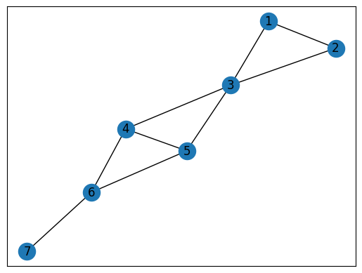
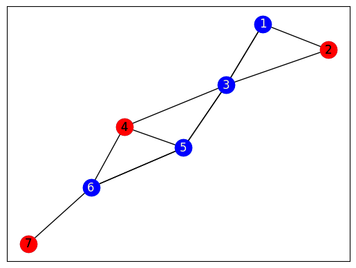

[](
  https://circleci.com/gh/dwave-examples/antenna-selection)

# Antennas Selection

This code was taken from the webinar, *Quantum Programming with the Ocean Tools
Suite* [[2]](#2).

The graph below represents antenna coverage. Each of the seven nodes below
represents an antenna with some amount of coverage. Note that the coverage
provided by each antenna is identical. The edges between each node represent
antennas with overlapping coverage.



Problem: Given the above set of antennas, which antennas should you choose such
that you maximize antenna coverage without any overlaps?

Solution: One possible solution is indicated by the red nodes below.



This problem is an example of an optimization problem known as the maximum
independent set problem.  Our objective is to maximize the number of nodes in a
set, with the constraint that no edges be contained in the set.  To solve on a
D-Wave system, we can reformulate this problem as a quadratic unconstrained
binary optimization problem (QUBO).  There are a wide variety of applications
for this problem, such as scheduling and error correcting codes (as shown in
[[1]](#1)).

## Usage

To run the demo:

```bash
python antennas.py
```

After running, the largest independent set found in the graph will be printed
to the command line and two images (.png files) will be created.  An image of
the original graph can be found in the file `antenna_plot_original.png`, and
an image of the graph with the nodes in the independent set highlighted in a
different color can be found in the file `antenna_plot_solution.png`.

To run the program on a different problem, modify graph G to represent a
different antenna network.

## Code Overview

The program `antennas.py` creates a graph using the Python package `networkx`,
and then uses the Ocean software tools to run the `maximum_independent_set`
function from within the `dwave_networkx` package.

## Further Information

<a name="1">[1]</a> Sergiy Butenko and Panagote M. Pardalos. "Maximum independent set and
   related problems, with applications." PhD dissertation, University of
   Florida, 2003.

<a name="2">[2]</a> Victoria Goliber, "Quantum Programming with the Ocean Tools Suite",
   https://www.youtube.com/watch?v=ckJ59gsFllU

[3] Andrew Lucas, "Ising formulations of many NP problems", [doi:
   10.3389/fphy.2014.00005](https://www.frontiersin.org/articles/10.3389/fphy.2014.00005/full)

## License

Released under the Apache License 2.0. See [LICENSE](LICENSE) file.
